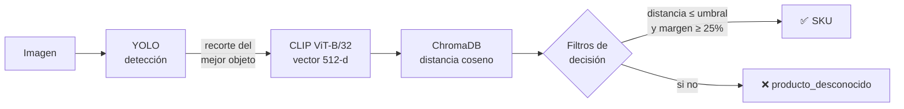

<div align="center">

# 🛒 caja-ia-service

**Microservicio de reconocimiento visual de productos para caja registradora**

Detecta un producto en una imagen y devuelve su SKU combinando detección de objetos,
embeddings visuales y búsqueda por similitud vectorial.

[](https://www.python.org/)
[](https://fastapi.tiangolo.com/)
[](https://docs.ultralytics.com/)
[](https://github.com/openai/CLIP)
[](https://www.trychroma.com/)
[](#-despliegue-con-docker)

</div>

---

## 📋 Tabla de contenidos

- [Descripción](#-descripción)
- [Arquitectura](#-arquitectura)
- [Stack tecnológico](#-stack-tecnológico)
- [Estructura del proyecto](#-estructura-del-proyecto)
- [Requisitos](#-requisitos)
- [Instalación](#-instalación)
- [Configuración](#-configuración)
- [Ejecución](#-ejecución)
- [Referencia de la API](#-referencia-de-la-api)
- [Observabilidad](#-observabilidad)
- [Despliegue con Docker](#-despliegue-con-docker)
- [Tests](#-tests)
- [Scripts](#-scripts)
- [Seguridad](#-seguridad)
- [Licencia](#-licencia)

---

## 📖 Descripción

`caja-ia-service` es un microservicio HTTP autónomo que expone el reconocimiento
de productos por imagen. Está pensado para ser consumido por **`caja-backend`**
(app Django `ia_service`) mediante una **API key compartida**, y aísla toda la
carga de modelos de IA fuera del backend principal.

Dado un fotograma de la cámara de caja, el servicio responde con el **SKU** del
producto reconocido, su nivel de confianza y la caja delimitadora, o bien indica
que el producto es desconocido o que no se detectó nada.

---

## 🏗 Arquitectura



El pipeline vive en `service/reconocedor.py` y las **reglas de decisión** están
aisladas como lógica pura en `service/matching.py`:

| Filtro | Regla | Configurable con |
|--------|-------|------------------|
| **Distancia absoluta** | la mejor distancia debe ser ≤ umbral | `UMBRAL_SIMILITUD` |
| **Margen entre SKUs** | el ganador debe quedar ≥ 25 % más cerca que el 2.º SKU | constante en `matching.py` |

> Los ids de ChromaDB siguen el formato `SKU_NOMBRE_NN` (p. ej.
> `BEB-001_INKA KOLA_03`). El SKU es el primer segmento y es lo que se devuelve
> al backend.

---

## 🧰 Stack tecnológico

| Capa | Tecnología |
|------|------------|
| API HTTP | FastAPI + Uvicorn |
| Detección de objetos | Ultralytics YOLO (ONNX Runtime) |
| Embeddings visuales | OpenAI CLIP ViT-B/32 (PyTorch) |
| Búsqueda vectorial | ChromaDB (distancia coseno, HNSW) |
| Configuración | Pydantic Settings |
| Contenedor | Docker (Python 3.11-slim) |

---

## 📂 Estructura del proyecto

```
caja-ia-service/
├── main.py                     # Endpoints, límites, concurrencia y ciclo de vida
├── auth.py                     # Validación de la cabecera X-API-Key
├── config.py                   # Configuración validada + rutas derivadas
├── service/
│   ├── reconocedor.py          # Orquesta YOLO + CLIP + ChromaDB
│   ├── matching.py             # Reglas de decisión (lógica pura, testeable)
│   ├── contexto.py             # Request-id propagable + inyección en logs
│   ├── metrics.py              # Métricas en memoria (latencias, tasa por resultado)
│   └── ratelimit.py            # Límite de tasa por cliente
├── scripts/
│   ├── entrenar_yolo.py        # Entrena y exporta el modelo a ONNX
│   ├── registrar_inventario.py # Carga fotos_catalogo/ en ChromaDB
│   ├── backup_chroma.py        # Backup de la base vectorial
│   └── test_*.py               # Diagnóstico sobre fichero y cámara
├── tests/                      # Tests de decisión, rate limit y métricas
├── models_ia/best.onnx         # Pesos del detector YOLO
├── requirements.txt            # Dependencias de runtime (versiones fijadas)
├── requirements-dev.txt        # + herramientas de test
├── Dockerfile
└── .env.example
```

---

## ✅ Requisitos

- **Python 3.11**
- **Git** (necesario para instalar CLIP, que no está publicado en PyPI)
- ~2 GB de espacio para modelos y dependencias
- GPU NVIDIA **opcional** (acelera CLIP; ver nota GPU en `requirements.txt`)

---

## 🚀 Instalación

```bash
# 1. Clonar y crear entorno
python -m venv venv
venv\Scripts\activate            # Windows
# source venv/bin/activate       # Linux / macOS

# 2. Instalar dependencias (con extras de test)
pip install -r requirements-dev.txt

# 3. Configurar variables de entorno
copy .env.example .env           # Windows  (cp en Linux/macOS)
# → editar .env y rellenar IA_SERVICE_API_KEY

# 4. Preparar modelo y catálogo
python scripts/entrenar_yolo.py          # genera models_ia/best.onnx
python scripts/registrar_inventario.py   # indexa fotos_catalogo/ en ChromaDB
```

Genera una API key robusta con:

```bash
python -c "import secrets; print(secrets.token_urlsafe(48))"
```

> ⚠️ `IA_SERVICE_API_KEY` **debe coincidir** exactamente con la variable del
> mismo nombre en el `.env` de `caja-backend`.

---

## ⚙️ Configuración

Todas las variables se leen del entorno o de `.env` y se **validan al arrancar**:
si alguna es inválida, el proceso falla de inmediato en lugar de hacerlo a mitad
de una petición.

| Variable | Defecto | Descripción |
|----------|:-------:|-------------|
| `IA_SERVICE_HOST` | `0.0.0.0` | Interfaz de escucha |
| `IA_SERVICE_PORT` | `8001` | Puerto |
| `IA_SERVICE_API_KEY` | — | **Requerida.** Clave compartida (≥ 32 caracteres) |
| `UMBRAL_SIMILITUD` | `0.23` | Distancia coseno máxima aceptada (0–1) |
| `UMBRAL_YOLO_CONF` | `0.4` | Confianza mínima de detección (0–1) |
| `YOLO_MODEL_PATH` | `models_ia/best.onnx` | Ruta del modelo |
| `CHROMA_DB_PATH` | `db_vectorial` | Ruta de la base vectorial |
| `CHROMA_COLLECTION` | `productos_visuales` | Colección de ChromaDB |
| `MAX_IMAGE_SIZE_MB` | `5` | Tamaño máximo de la subida |
| `MAX_IMAGE_PIXELS` | `40000000` | Tope de píxeles (anti *decompression bomb*) |
| `MAX_PETICIONES_CONCURRENTES` | `2` | Inferencias simultáneas |
| `RATE_LIMIT_POR_MINUTO` | `120` | Peticiones/min por cliente a `/reconocer` (`0` = desactivado) |
| `LOG_LEVEL` | `INFO` | Nivel de logging |

---

## ▶️ Ejecución

```bash
python main.py
```

El servicio arranca en `http://localhost:8001`. Los modelos se cargan **una sola
vez** al iniciar; si la carga falla, el servicio arranca igual para que `/health`
pueda reportar el motivo.

---

## 🌐 Referencia de la API

Todos los endpoints salvo `/health` requieren la cabecera **`X-API-Key`**.

| Método | Endpoint | Descripción |
|--------|----------|-------------|
| `GET` | `/health` | Estado del servicio (público) |
| `POST` | `/reconocer` | Reconoce el producto de una imagen |
| `POST` | `/registrar` | Registra una foto de producto en el catálogo |
| `DELETE` | `/producto/{id_chroma}` | Elimina un registro del catálogo |
| `GET` | `/catalogo/stats` | Número de vectores en el catálogo |
| `GET` | `/metrics` | Métricas en memoria del proceso |

### `POST /reconocer`

```bash
curl -X POST http://localhost:8001/reconocer \
  -H "X-API-Key: $IA_SERVICE_API_KEY" \
  -F "imagen=@producto.jpg"
```

```jsonc
// 200 OK — producto reconocido
{
  "resultado": "ok",
  "sku": "BEB-001",
  "confianza": 0.87,
  "bbox": [34, 51, 220, 410],
  "confianza_yolo": 0.91,
  "latencia_ms": 142
}
```

Valores posibles de `resultado`: `ok` · `no_detectado` · `producto_desconocido` · `catalogo_vacio`.

### `POST /registrar`

```bash
curl -X POST http://localhost:8001/registrar \
  -H "X-API-Key: $IA_SERVICE_API_KEY" \
  -F "imagen=@foto.jpg" \
  -F "id_chroma=BEB-001_INKA KOLA_03"
```

```json
{ "ok": true, "id_chroma": "BEB-001_INKA KOLA_03", "total_catalogo": 63 }
```

### `GET /health`

```json
{ "status": "ok", "modelo_cargado": true, "total_catalogo": 62 }
```

### Códigos de estado

| Código | Significado |
|:------:|-------------|
| `200` | OK |
| `401` | API key ausente o inválida |
| `413` | Imagen mayor al límite (`/reconocer`, `/registrar`) |
| `422` | Imagen inválida o corrupta |
| `429` | Límite de tasa superado |
| `500` | Error interno (el detalle va a los logs, no a la respuesta) |
| `503` | Modelos no cargados aún / fallo de arranque |

---

## 📊 Observabilidad

- **Correlación de logs** — el servicio lee y emite la cabecera `X-Request-ID`.
  Si el backend la envía, se reutiliza y aparece en cada línea de log; permite
  cruzar los registros de ambos servicios por el mismo identificador.
- **Métricas** — `GET /metrics` expone contadores por resultado y percentiles de
  latencia (p50/p95/p99/máx) sobre una ventana en memoria:

  ```json
  {
    "total_reconocimientos": 1284,
    "por_resultado": { "ok": 951, "producto_desconocido": 233, "no_detectado": 100 },
    "latencia_ms": { "muestras": 1000, "p50": 138, "p95": 310, "p99": 480, "max": 902 }
  }
  ```

  > Las métricas son *por proceso*. Con varios workers, cada uno expone las
  > suyas. Para agregación persistente, exportar a Prometheus.

---

## 🐳 Despliegue con Docker

La imagen **no** incluye `.env`, `db_vectorial/` ni `fotos_catalogo/`
(ver `.dockerignore`): la configuración se inyecta por entorno y la base
vectorial se monta como volumen persistente.

```bash
docker build -t caja-ia-service .

docker run -p 8001:8001 \
  -e IA_SERVICE_API_KEY="<misma-clave-que-el-backend>" \
  -v /ruta/persistente/db_vectorial:/app/db_vectorial \
  caja-ia-service
```

**Notas de despliegue:**

- El contenedor corre como usuario **no privilegiado** `appuser` (uid 10001).
  El volumen montado debe ser escribible por ese uid.
- Incluye `HEALTHCHECK` sobre `/health` (con 90 s de margen para la carga inicial).
- Para **GPU**, instalar las ruedas CUDA de PyTorch (ver cabecera de `requirements.txt`).
- El modelo `models_ia/best.onnx` viaja en la imagen; para versionarlo en git,
  usar Git LFS (ver `.gitattributes`) o publicarlo como artefacto externo.

---

## 🧪 Tests

```bash
pip install -r requirements-dev.txt
pytest tests/ -q
```

La lógica de decisión (`service/matching.py`) es **pura**: se prueba en
milisegundos sin cargar YOLO, CLIP ni ChromaDB.

---

## 🛠 Scripts

| Script | Uso |
|--------|-----|
| `scripts/entrenar_yolo.py` | Entrena YOLO y exporta a ONNX, comparando con el modelo actual |
| `scripts/registrar_inventario.py` | Indexa `fotos_catalogo/` en ChromaDB |
| `scripts/backup_chroma.py` | Copia de seguridad con marca de tiempo de `db_vectorial/` |
| `scripts/test_deteccion.py` | Diagnóstico YOLO + CLIP sobre imagen o carpeta |
| `scripts/test_camara.py` | Detección YOLO en cámara en tiempo real |
| `scripts/test_camara_vector.py` | Pipeline completo en cámara con votación temporal |

```bash
python scripts/test_deteccion.py foto.jpg --guardar
python scripts/backup_chroma.py
```

---

## 🔒 Seguridad

- **Autenticación** por API key con comparación en **tiempo constante**
  (`hmac.compare_digest`) para evitar ataques por temporización.
- **Límites de entrada**: tamaño de subida, tope de píxeles (anti
  *decompression bomb*) y validación de imagen.
- **Rate limiting** por cliente para acotar la carga sobre la GPU/CPU.
- Los errores internos **no** exponen trazas ni rutas al cliente; el detalle
  queda únicamente en los logs.
- Secretos fuera de la imagen y del control de versiones (`.env` en `.gitignore`
  y `.dockerignore`).

---

## 📄 Licencia

Este proyecto se distribuye bajo la licencia **GNU Affero General Public License v3.0 (AGPL-3.0)**.

Esto significa que puedes usar, modificar y redistribuir el código, pero **cualquier obra
derivada —incluso si se ofrece como servicio a través de una red— debe publicarse también
bajo AGPL-3.0 y poner su código fuente a disposición**. Se eligió esta licencia por
compatibilidad con las dependencias del sistema de reconocimiento de imágenes (Ultralytics YOLO).

Consulta el archivo [LICENSE](LICENSE) para el texto completo.

---

<div align="center">
<sub>Parte del ecosistema <b>Caja Registradora Inteligente</b> · consumido por <code>caja-backend</code></sub>
</div>
